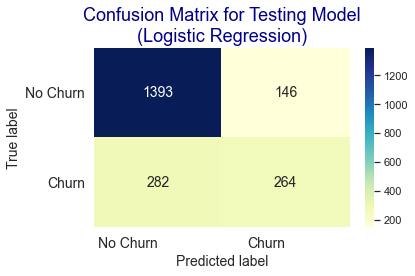

# Data Telco : Customer Churn Prediction Using Machine Learning 

## Code and Resources :
- Python Version: 3.6
- Packages: pandas, matplotlib, seaborn, numpy, sklearn
- Dataset : https://dqlab-dataset.s3-ap-southeast-1.amazonaws.com/dqlab_telco_final.csv
- Case Study : DQLab

### EDA (Exploratory Data Analysis)
### Pre-Processing of Data
### Machine Learning Modeling
-	Logistic Regression
-	Random Forest
-	Extreme Gradiant Boos
### Determining the Best Model	
We chose the Logistic Regression algorithm as the best modeling, because this algorithm can predict well in the training and testing phases.

